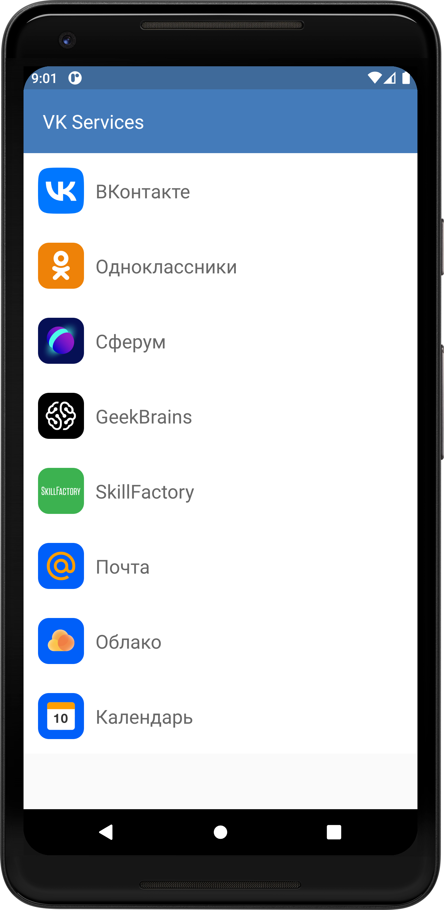

# VK services list example app
VK services list example app. Using Kotlin Flow, Retrofit and Dagger2, etc.

## Description
An example app for getting list of VK services was made as a task for Android Development competition.

App is built according to the principles of <a href="https://blog.cleancoder.com/uncle-bob/2012/08/13/the-clean-architecture.html">Сlean architecture</a>.

MVVM is used as a design pattern.

## App features
User may:
* See VK services list with its logo and name
* See service details by clicking on service list item
* Open service website or application from link button
* See connection errors

## Libraries
* <a href="https://developer.android.com/topic/libraries/architecture/lifecycle">Lifecycle</a>
* <a href="https://developer.android.com/topic/libraries/architecture/viewmodel">ViewModel</a>
* <a href="https://github.com/square/retrofit">Retrofit2</a>
* <a href="https://developer.android.com/training/dependency-injection/dagger-android">Dagger2</a>
* <a href="https://github.com/square/okhttp">OkHttp</a>
* <a href="https://github.com/Kotlin/kotlinx.coroutines">Kotlin Coroutines</a>

## Sceenshots
 
